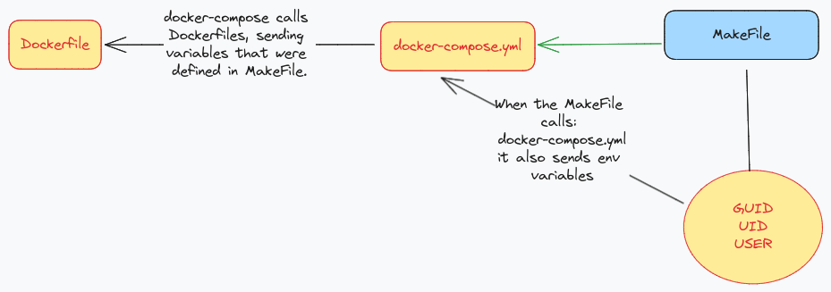

Recently I decided to start my path to be a DevOps developer. So, in first instance I've learned Docker; at least the basics. After this, I wanted to dockerize a real project from my company where I currently work. It was kinda easy but some errors and complications suddenly appeared. When I finally was able to dockerize the whole project including: 
- PHP
- NGINX
- PGSQL
- NODE

I began to get into Jenkins. I watched a lot of tutorials and try to understand the Jenkins file to set up a Pipeline with Laravel. In consecuence, I create those scripts: `Makefile`,  `Jenkinsfile` , `docker-compose.yml` a nginx-php `Dockerfile`.

Everything was going over the heels until... UNTIL THE DEVIL APPEARED!! Nah, I'm just kidding. It was something worse, the motherfucker permissions. Curiously, everytime that I would run the pipeline, an error message showed. 
```
Selected Git installation does not exist. Using Default The recommended git tool is: NONE
```

I tried everything, since reinstalling GIT, until changing the git path. Nothing works. But I noticed something more... There was another error message:
```
java.nio.file.AccessDeniedException: /var/lib/jenkins/
```
ACCESS FUCKING DENIED???

What I inmediatly did? `cd /var/lib/jenkins/workspace/project-name` `ls -la`

```
drwxr-xr-x 13 systemd-network systemd-journal   4096 Dec  9 08:41 .
drwxr-xr-x  4 jenkins         jenkins           4096 Dec  8 20:58 ..
drwxr-xr-x  9 systemd-network systemd-journal   4096 Dec  8 20:58 app
-rwxr-xr-x  1 systemd-network systemd-journal   1686 Dec  8 22:07 artisan
drwxr-xr-x  3 systemd-network systemd-journal   4096 Dec  8 22:07 bootstrap
-rwxr-xr-x  1 systemd-network systemd-journal   2309 Dec  8 22:07 composer.json
-rwxr-xr-x  1 systemd-network systemd-journal 398551 Dec  8 22:07 composer.lock
drwxr-xr-x  2 systemd-network systemd-journal   4096 Dec  8 22:07 config
drwxr-xr-x  5 systemd-network systemd-journal   4096 Dec  8 22:07 database
-rwxr-xr-x  1 systemd-network systemd-journal   1199 Dec  8 22:07 default.conf
-rwxr-xr-x  1 systemd-network systemd-journal    977 Dec  9 08:41 docker-compose.yml
-rwxr-xr-x  1 systemd-network systemd-journal    527 Dec  9 08:41 Dockerfile
-rwxr-xr-x  1 systemd-network systemd-journal    258 Dec  8 22:07 .editorconfig
-rwxr-xr-x  1 systemd-network systemd-journal   1097 Dec  8 22:07 .env.example
drwxr-xr-x  8 systemd-network systemd-journal   4096 Dec  9 08:41 .git
-rwxr-xr-x  1 systemd-network systemd-journal    186 Dec  8 22:07 .gitattributes
-rwxr-xr-x  1 systemd-network systemd-journal    243 Dec  8 22:07 .gitignore
-rwxr-xr-x  1 systemd-network systemd-journal   1239 Dec  9 08:41 Jenkinsfile
-rwxr-xr-x  1 systemd-network systemd-journal    165 Dec  9 08:41 Makefile
-rwxr-xr-x  1 systemd-network systemd-journal    427 Dec  8 22:07 package.json
-rwxr-xr-x  1 systemd-network systemd-journal 290297 Dec  8 22:07 package-lock.json
-rw-r--r--  1 systemd-network systemd-journal    264 Dec  8 21:57 .phpunit.result.cache
-rwxr-xr-x  1 systemd-network systemd-journal   1084 Dec  8 22:07 phpunit.xml
drwxr-xr-x  4 systemd-network systemd-journal   4096 Dec  8 22:07 public
-rwxr-xr-x  1 systemd-network systemd-journal   1114 Dec  8 22:07 README.md
drwxr-xr-x  6 systemd-network systemd-journal   4096 Dec  8 20:58 resources
drwxr-xr-x  2 systemd-network systemd-journal   4096 Dec  8 22:07 routes
drwxr-xr-x  5 systemd-network systemd-journal   4096 Dec  8 20:58 storage
drwxr-xr-x  5 systemd-network systemd-journal   4096 Dec  8 22:07 tests
drwxr-xr-x 57 systemd-network systemd-journal   4096 Dec  8 20:59 vendor
-rwxr-xr-x  1 systemd-network systemd-journal    469 Dec  8 22:07 vite.config.js
```
WTF???
`systemd-network` ???

Yeah I know I know... it's my fault. The `.git` directory wasn't being found because the new owner of the volume was another one. Everytime that I executed a docker command the directory owner was being changed.

Now... I discored that the group_user_id, user_id, and user_name must be specified when I build the image since the Dockerfile, that is sent by the `docker-compose.yml` file which pulls info from the `Makefile` file. FUUCK!

I noticed how the flow should work. It'll be explained in the next figure.



I don't know how to solve it yet. Yesterday I gave up, it was almost mid-night. Today I'll spend all day trying to figure it out. I'll be updating this post. Give me luck. 